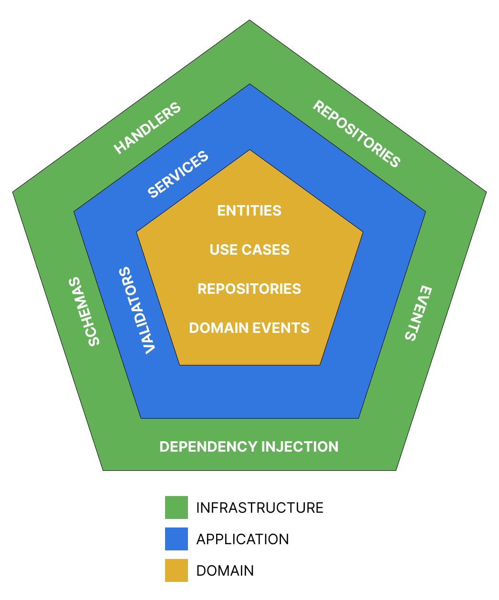

# Python Fastapi Hexagonal architecture

- Principal layers:
  - Domain
  - Application
  - Infrastructure



- Structure

```bash
└── app
    ├── application
    │   ├── validators # Validation logic for input data
    │   └── services # Implement the use cases
    ├── domain
    │   ├── entities # Entities with business logic
    │   ├── events # Interface that defines how an event behaves
    │   ├── repositories # Interface that defines how a data repository behaves
    │   ├── use cases # Interface that defines the use cases of the application
    │   └── exceptions # Domain exceptions
    └── infrastructure
        ├── events # Implements the domain event interface
        ├── handlers # Application entry point
        ├── repositories # Implements the domain repository interface
        ├── schemas # Data structures used as input and output
        └── container # Dependency injector
```

**Technologies**

- python
- fastapi
- dependency-injector
- pydantic
- docker
- make

**Commands**

```bash
$ make build #Create docker images
```

```bash
$ make up #Run the docker container
```

```bash
$ make down #Stop the docker container
```

**References**

- https://alistair.cockburn.us/hexagonal-architecture/
- http://wiki.c2.com/?HexagonalArchitecture
